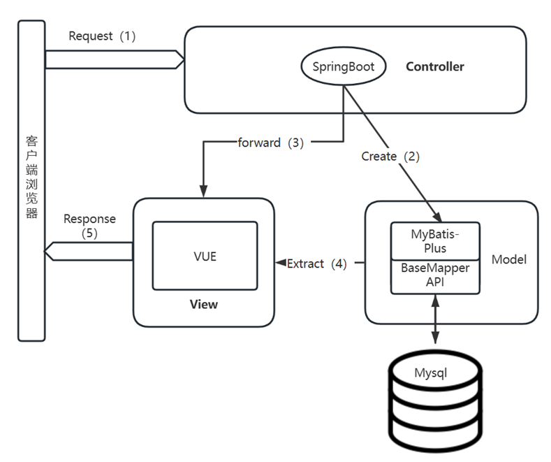
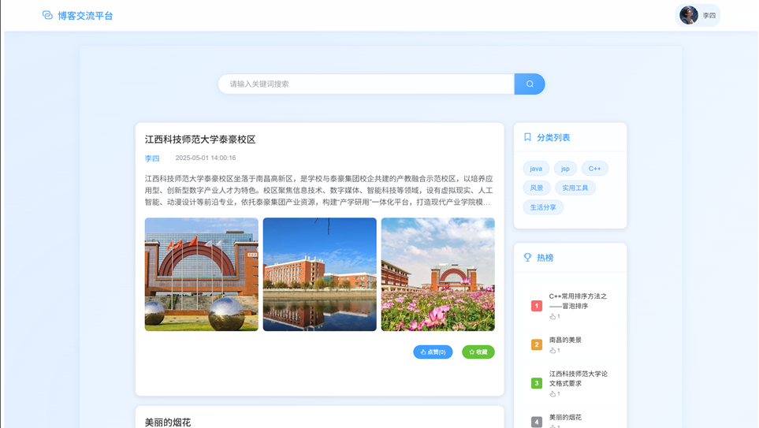
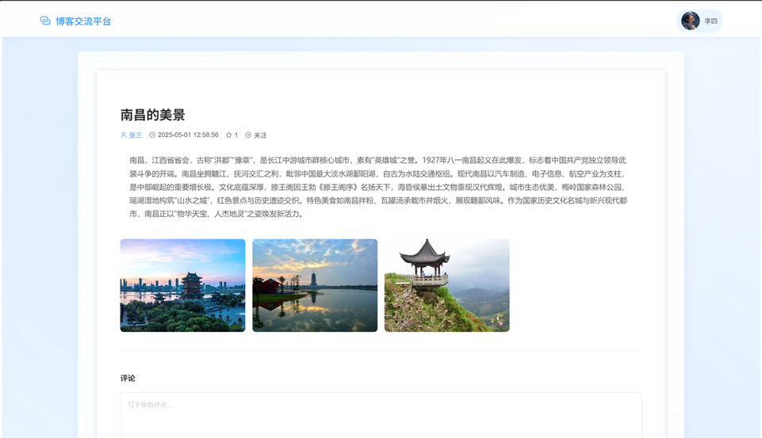
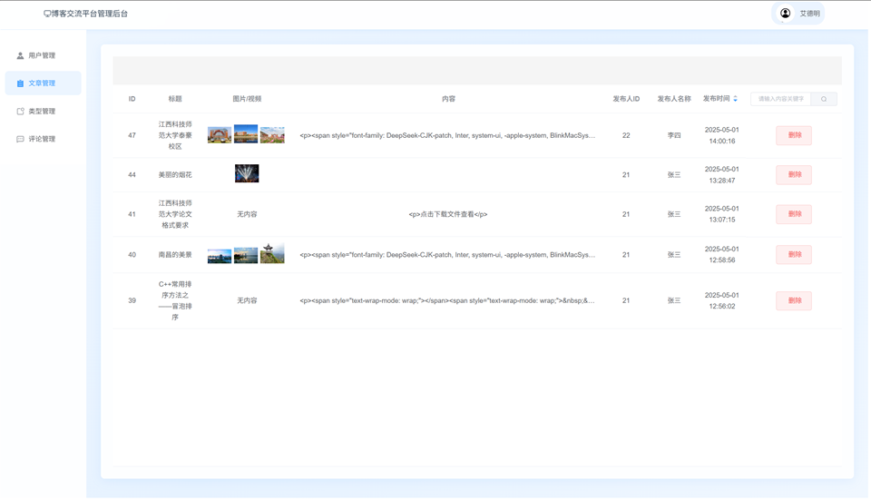
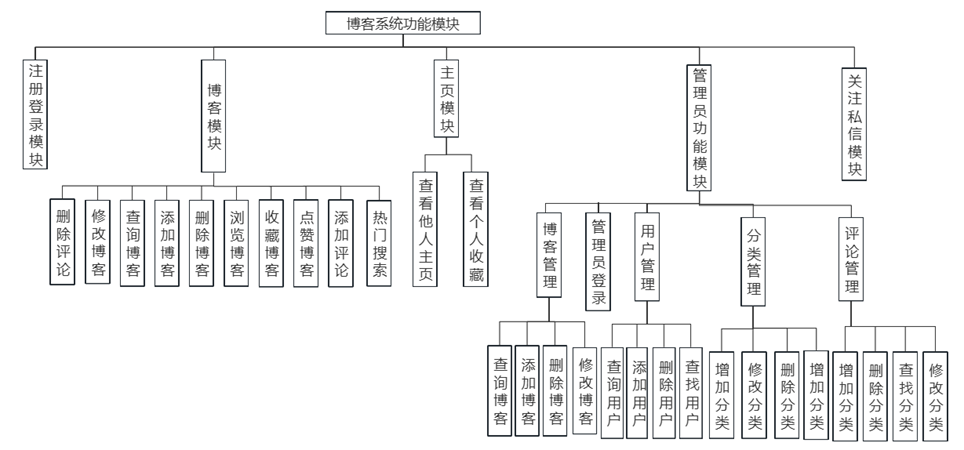
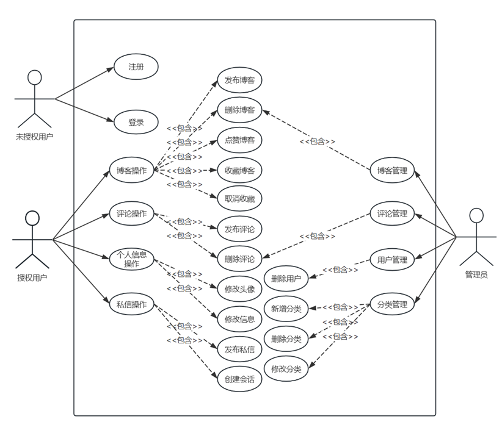
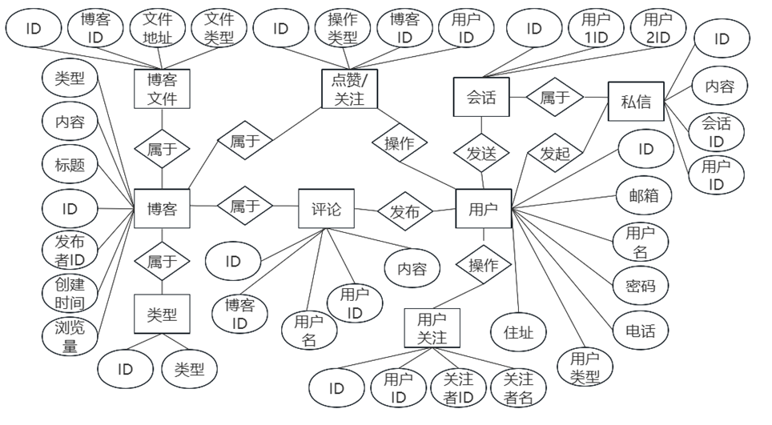

# 基于 SpringBoot 的博客系统

## 项目简介

本项目是一个功能完整的博客系统，采用前后端分离架构。后端基于 **Spring Boot 2.4.2** 框架构建，前端使用 **Vue 2** 配合 **Element-UI** 实现。系统提供了用户注册登录、博客文章发布与管理、评论互动、点赞收藏、用户关注、私信聊天以及管理员后台管理等核心功能。博客内容支持富文本编辑（UEditor），并可嵌入图片、视频、文档等多种媒体格式。

## 系统展示

### 系统架构



### 系统界面预览

| 系统首页 | 博客发布 |
|----------|----------|
|  |  |

| 管理员后台 |
|------------|
|  |

### 功能模块与设计

| 博客系统功能模块图 | 系统UML用例图 |
|-------------------|---------------|
|  |  |

| 数据库ER图 |
|------------|
|  |

## 技术栈

### 后端

| 技术 | 版本 | 用途 |
|------|------|------|
| Spring Boot | 2.4.2 | 应用框架 |
| Java | 8 | 开发语言 |
| MyBatis-Plus | 3.4.2 | ORM 框架 |
| MySQL | 8.0+ | 数据库 |
| Druid | 1.2.5 | 数据库连接池 |
| Lombok | - | 代码简化 |
| Hutool | 5.8.5 | Java 工具库 |
| Swagger Annotations | 1.5.22 | API 文档注解 |
| MyBatis-Plus Generator | 3.4.1 | 代码生成器 |

### 前端

| 技术 | 版本 | 用途 |
|------|------|------|
| Vue | 2.6.12 | 前端框架 |
| Vue Router | 3.5.1 | 前端路由 |
| Vuex | 3.6.2 | 状态管理 |
| Element-UI | 2.15.14 | UI 组件库 |
| Axios | 0.21.1 | HTTP 客户端 |
| ECharts | 5.1.1 | 图表展示 |
| UEditor | - | 富文本编辑器 |
| vue-markdown | 2.2.4 | Markdown 渲染 |

## 功能模块

### 1. 用户模块
- **注册**：用户通过邮箱、用户名、密码注册账号
- **登录**：支持普通用户登录和管理员登录
- **个人信息管理**：编辑头像、昵称、地址、联系方式等
- **个人主页**：展示用户信息、发布的博客列表

### 2. 博客模块
- **发布博客**：支持富文本编辑，可插入图片、视频、文档等多媒体内容
- **博客分类**：按类型（如 Java、JSP 等）对博客进行分类管理
- **博客浏览**：按时间倒序展示，支持按类型筛选和标题关键词搜索
- **博客详情**：查看完整内容，显示作者、发布时间、阅读量等
- **热门博客**：按阅读量排序展示热门文章

### 3. 互动模块
- **评论系统**：用户可对博客发表评论
- **点赞/收藏**：支持对博客进行点赞和收藏操作
- **阅读计数**：自动统计每篇博客的阅读次数

### 4. 社交模块
- **用户关注**：关注感兴趣的用户，建立社交关系
- **私信聊天**：互相关注的用户之间可发送私信（一对一实时沟通）
- **会话管理**：查看历史聊天记录

### 5. 管理员模块
- **用户管理**：查看用户信息、禁用/删除违规用户账号
- **博客管理**：审核和管理所有博客文章
- **分类管理**：新增、编辑、删除博客分类
- **评论管理**：审核和管理用户评论

## 数据库设计

系统包含 10 张核心数据表：

| 表名 | 说明 | 核心字段 |
|------|------|----------|
| `user` | 用户表 | user_id, email, user_name, user_pwd, role, avatar |
| `blog` | 博客表 | id, title, content, user_id, type, count, create_time |
| `blog_file` | 博客文件关联表 | id, blog_id, image_url, type(img/video/doc) |
| `comment` | 评论表 | id, user_id, blog_id, content, create_time |
| `operation` | 操作表（点赞/收藏） | id, type(1/2), blog_id, user_id |
| `type` | 分类表 | id, name |
| `user_follow` | 用户关注表 | id, user_id, follow_user_id |
| `session` | 会话表 | id, user1_id, user2_id |
| `message` | 私信表 | id, content, session_id, message_user_id |
| `file` | 文件记录表 | id, name, type, size, url, md5 |

## 快速开始

### 环境要求

- JDK 1.8+
- Maven 3.6+
- MySQL 8.0+
- Node.js 12+
- npm 6+

### 1. 数据库初始化

```sql
-- 创建数据库
CREATE DATABASE blog CHARACTER SET utf8mb4 COLLATE utf8mb4_general_ci;

-- 导入表结构与测试数据
mysql -u root -p blog < blog.sql
```

### 2. 后端启动

```bash
cd springboot

# 修改数据库连接配置
# 编辑 src/main/resources/application.properties
# 设置你的数据库用户名和密码

# 编译运行
mvn spring-boot:run
```

后端默认启动在 `http://localhost:8082`。

### 3. 前端启动

```bash
cd vue

# 安装依赖
npm install

# 启动开发服务器
npm run serve
```

前端默认启动在 `http://localhost:8080`。

### 4. 访问系统

- 普通用户端：`http://localhost:8080`
- 管理员端：`http://localhost:8080/adminLogin`

### 默认账号

| 角色 | 用户名 | 密码 | 说明 |
|------|--------|------|------|
| 管理员 | admin | admin | 拥有全部管理权限 |
| 普通用户 | user | user | 可发布博客、评论、关注等 |

## 项目结构

```
WebBlog/
├── springboot/                 # 后端项目
│   ├── src/
│   │   ├── main/
│   │   │   ├── java/com/blog/springboot/
│   │   │   │   ├── BlogApplication.java          # 启动类
│   │   │   │   ├── config/                       # 配置类
│   │   │   │   │   ├── CorsConfig.java           # 跨域配置
│   │   │   │   │   ├── MyBatisPlusConfig.java    # MyBatis-Plus 配置
│   │   │   │   │   └── WebMvcConfiguration.java  # Web MVC 配置
│   │   │   │   ├── controller/                   # 控制器层
│   │   │   │   │   ├── BlogController.java       # 博客管理
│   │   │   │   │   ├── CommentController.java    # 评论管理
│   │   │   │   │   ├── FileController.java       # 文件上传
│   │   │   │   │   ├── MessageController.java    # 私信管理
│   │   │   │   │   ├── OperationController.java  # 点赞/收藏
│   │   │   │   │   ├── SessionController.java    # 会话管理
│   │   │   │   │   ├── TypeController.java       # 分类管理
│   │   │   │   │   ├── UserController.java       # 用户管理
│   │   │   │   │   └── UserFollowController.java # 关注管理
│   │   │   │   ├── dao/                          # 数据访问层
│   │   │   │   ├── lang/                         # 工具类
│   │   │   │   │   ├── Result.java               # 统一响应封装
│   │   │   │   │   └── MetaHandler.java          # 自动填充处理
│   │   │   │   ├── model/entity/                 # 实体类
│   │   │   │   ├── model/*.java                  # DTO 类
│   │   │   │   ├── service/                      # 业务逻辑层
│   │   │   │   │   └── impl/                     # 实现类
│   │   │   │   └── utils/                        # 工具类
│   │   │   └── resources/
│   │   │       ├── application.properties        # 应用配置
│   │   │       └── file/                         # 上传文件存储目录
│   │   └── test/
│   └── pom.xml
├── vue/                          # 前端项目
│   ├── src/
│   │   ├── main.js               # 入口文件
│   │   ├── App.vue               # 根组件
│   │   ├── axios.js              # Axios 配置
│   │   ├── router/index.js       # 路由配置
│   │   ├── store/index.js        # Vuex 状态管理
│   │   └── views/
│   │       ├── login/            # 登录注册页
│   │       │   ├── Login.vue
│   │       │   ├── AdminLogin.vue
│   │       │   ├── Register.vue
│   │       │   └── Index.vue
│   │       ├── dashboard/        # 仪表盘
│   │       │   └── Personnal.vue
│   │       ├── manage/           # 管理员管理页
│   │       │   ├── Blog.vue
│   │       │   ├── Comment.vue
│   │       │   ├── Type.vue
│   │       │   └── UserManage.vue
│   │       ├── userInterface/    # 用户界面
│   │       │   ├── BlogIndex.vue
│   │       │   ├── MyBlog.vue
│   │       │   ├── MyCollect.vue
│   │       │   ├── MyComment.vue
│   │       │   ├── MyFollow.vue
│   │       │   ├── MyMessage.vue
│   │       │   └── PersonalInfo.vue
│   │       └── error-page/       # 错误页
│   │           └── NotFound.vue
│   ├── package.json
│   └── vue.config.js
├── blog.sql                      # 数据库初始化脚本
└── README.md
```

## API 概览

| 请求方式 | 接口路径 | 说明 |
|----------|----------|------|
| POST | `/trading/create` | 创建博客 |
| POST | `/trading/delete/{id}` | 删除博客 |
| POST | `/trading/update` | 更新博客 |
| POST | `/trading/getTrading` | 获取全部博客 |
| POST | `/trading/selectBlog` | 按条件搜索博客 |
| POST | `/trading/selectHeatBlog` | 获取热门博客 |
| POST | `/trading/getTradingAll` | 获取最新5篇博客 |
| POST | `/trading/getTradingByUserId/{id}` | 获取用户博客列表 |
| POST | `/trading/getTradingById/{id}` | 获取博客详情 |
| POST | `/comment/...` | 评论相关接口 |
| POST | `/file/upload` | 文件上传 |
| POST | `/message/...` | 私信相关接口 |
| POST | `/operation/...` | 点赞/收藏接口 |
| POST | `/session/...` | 会话管理接口 |
| POST | `/type/...` | 分类管理接口 |
| POST | `/user/...` | 用户管理接口 |
| POST | `/userFollow/...` | 关注管理接口 |
| POST | `/login` | 用户登录 |
| POST | `/register` | 用户注册 |
